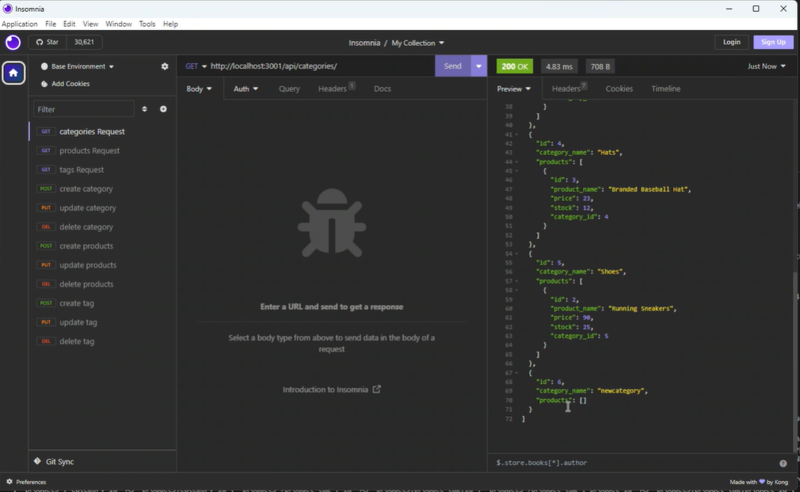

# E-commerce-Back-End
<p align="center">
    
    
    
    
    
</p>

## Description
Internet retail, also known as e-commerce, plays a significant role within the electronics industry, as it empowers businesses and consumers alike to conveniently engage in online buying and selling of electronic products. In the latest available data from 2021, the industry in the United States alone was estimated to have generated the substantial amount of US$2.54 trillion, according to the United Nations Conference on Trade and Development. E-commerce platforms like Shopify and WooCommerce provide a suite of services to businesses of all sizes. Due to the prevalence of these platforms, developers should understand the fundamental architecture of e-commerce sites.
## Table of Contents

- [Installation](#installation)
- [Usage](#usage)
- [Example](#example)
- [Full Walkthrough Video](#full-walkthrough-video)
- [Contributors](#contributors)
- [Questions](#questions)

## Installation

```
npm install
npm start
```

## Usage

```md
AS A manager at an internet retail company
I WANT a back end for my e-commerce website that uses the latest technologies
SO THAT my company can compete with other e-commerce companies
GIVEN a functional Express.js API
WHEN I add my database name, MySQL username, and MySQL password to an environment variable file
THEN I am able to connect to a database using Sequelize
WHEN I enter schema and seed commands
THEN a development database is created and is seeded with test data
WHEN I enter the command to invoke the application
THEN my server is started and the Sequelize models are synced to the MySQL database
WHEN I open API GET routes in Insomnia Core for categories, products, or tags
THEN the data for each of these routes is displayed in a formatted JSON
WHEN I test API POST, PUT, and DELETE routes in Insomnia Core
THEN I am able to successfully create, update, and delete data in my database
```

## Example



## Full Walkthrough Video
[Link](https://drive.google.com/file/d/1_K-mbx1Yh8X-hAK3_4uju7zk4Opfpcvd/view)


## Contributors

:octocat: [Kenny Zhang](https://github.com/KennyZhang12138)


## Questions

For additional questions, contact me at the email provided below.

- GitHub: [E-commerce-Back-End](https://github.com/KennyZhang12138/E-commerce-Back-End)